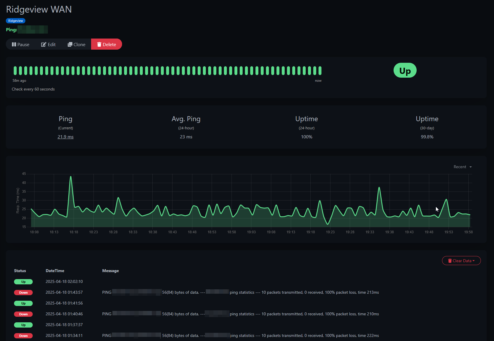
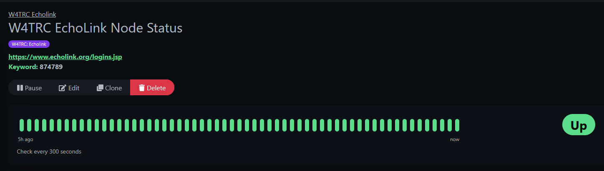

## My Monitoring Systems Overview

One of the main projects I like to work on with my homelab and now into some production usage is monitoring. Once I started self-hosting some applications and websites, I knew I wanted to make sure they were always available and working, thus began my journey into the world of monitoring systems. 

It seems like a boring topic, checking if something is working or not, but to me it's kind of a game of how much data can I pull and monitor? I've been monitoring everthing from website uptime, to network utilization, to battery and power status, and even to copier toner monitoring. Why? Because the data is out there and available.

## How it began: Uptime Kuma

The very first monitoring system I set up is a project called Uptime Kuma. (https://github.com/louislam/uptime-kuma). This is a very simple web app that mainly does ping based monitoring. This means it just checks if a site or IP address is up or down and reports on it.

This can be used to check if a location's internet is up or down, or making sure a website is accessible. Below is a monitor that is pinging my church's WAN IP every minute to alert when it goes down. 

Uptime Kuma can also do other monitors such as checking a website for a specific word or phrase to make sure it is there, or checking specific ports. 

One way I use this is for checking a radio system for the radio club I am a part of. We use a system called Echolink that bascially puts a radio that is hosted at my house on the internet for other radio operators to use to communicate on our repeater. The Echolink system has a webpage that lists all of the active connections on it, so I am able to do a keyword monitor in Uptime Kuma that checks that page and looks for our node number. If the number is not found in the list, our node has been disconnected and it will alert me. 

## Onto Zabbix

After using Uptime Kuma for a while, I decided it was time to expand my monitoring capabilities. I tried out a few different suites but decided on Zabbix. Zabbix is a free monitoring tool, but is super powerful and expandable. 

The main thing that drew me to Zabbix is the way that it can be set up as a distributed monitoring system. I have a main Zabbix Server that is hosted on a cloud VPS in Linode's Atlanta data center. I then have a Zabbix Proxy at my house and at church. These are small virtual machines that do all of the monitoring inside of the network and report back to the main server. See the diagram below.


graph TD
    %% Top layer
    ZabbixServer[Zabbix Server - Cloud]

    %% Middle layer - Proxies
    HomeProxy[Zabbix Proxy - Home]
    ChurchProxy[Zabbix Proxy - Church]

    ZabbixServer --> HomeProxy
    ZabbixServer --> ChurchProxy

    %% Home network
    subgraph "🏠 Home Network"
        HomeProxy --> HomePC1[PC 1]
        HomeProxy --> HomePC2[PC 2]
        HomeProxy --> HomeSwitch[Network Switch]
    end

    %% Church network
    subgraph "⛪ Church Network"
        ChurchProxy --> ChurchPC1[PC 1]
        ChurchProxy --> ChurchPC2[PC 2]
        ChurchProxy --> ChurchRouter[Router]
    end


This setup allows some flexbility and also security. With a proxy at each location, the devices at that location send their data to the proxy which then sends it encrypted to the main server for processing, storage, and alerting. This also allows each proxy to be able to do active checks on devices such as printers, network switches, and batteries that can't run a Zabbix agent to report data. 

For church, all of our computers have Zabbix agents on them that report tons of data from them to the Zabbix system. This can be things like uptime, if they are rebooting often, or drive, processor, or memory utilization. This allows me to keep an eye on all of our production systems to make sure that everything is running at full capacity. 

## Little bit of Grafana

## Tactical RMM

## Wazuh

## Injesting info